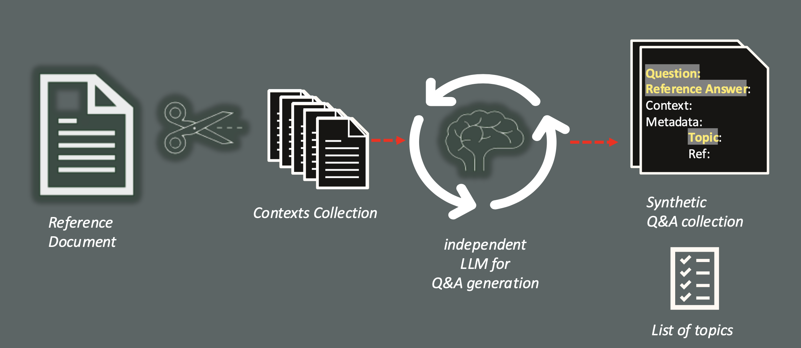
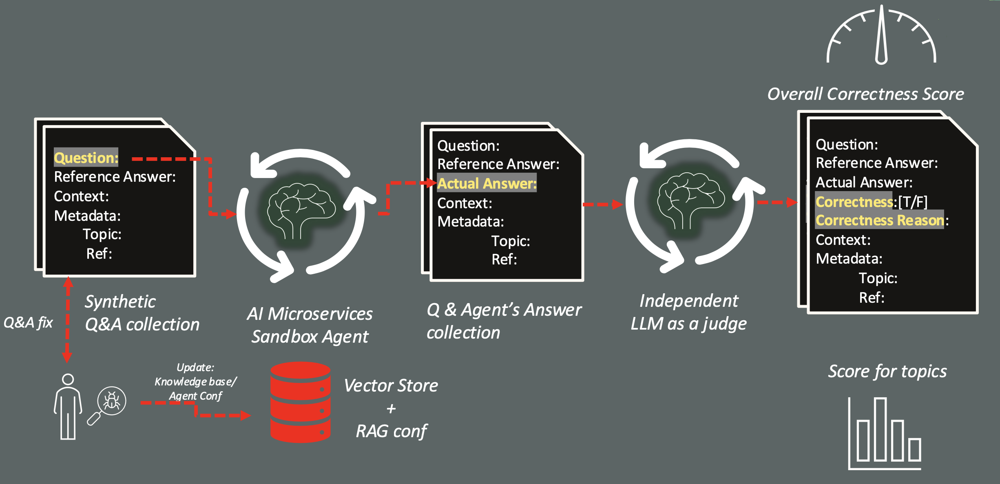
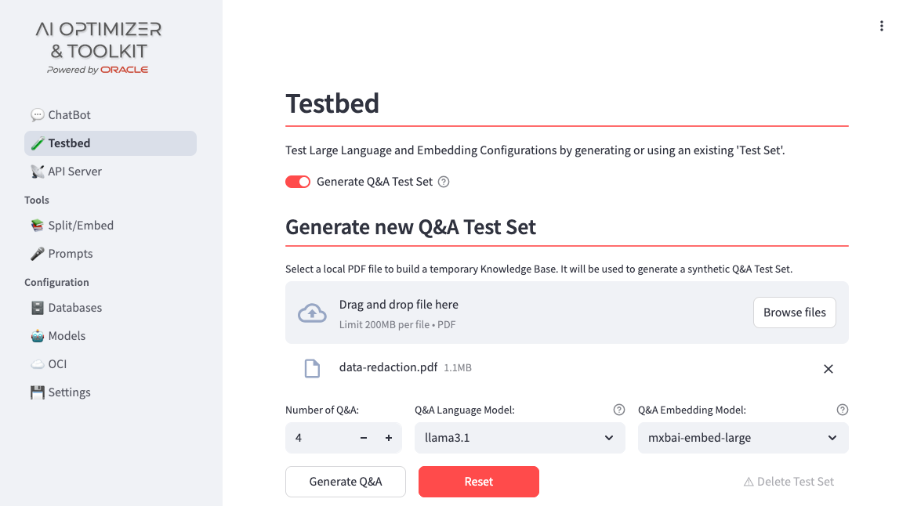
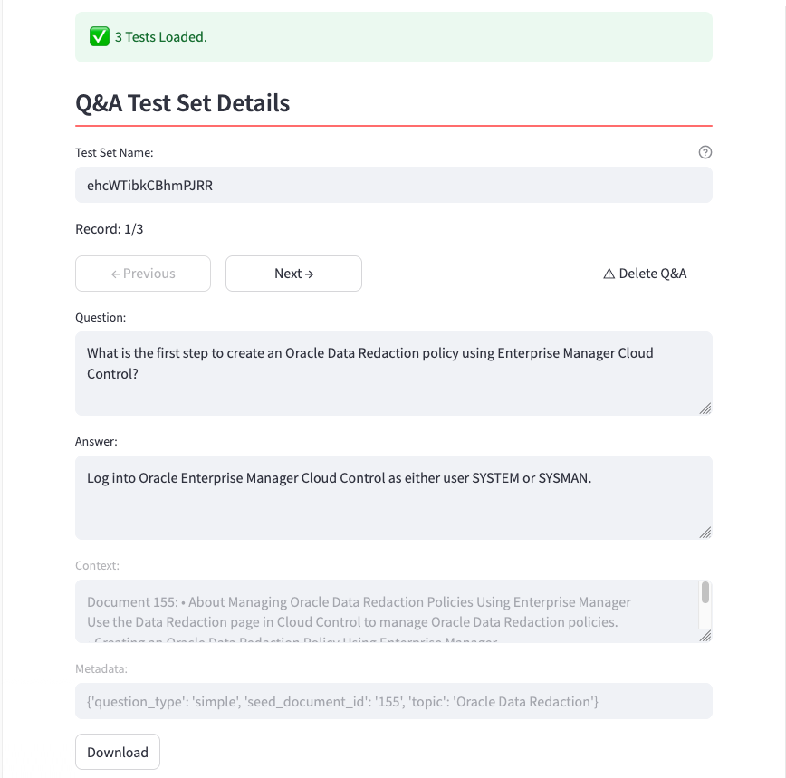
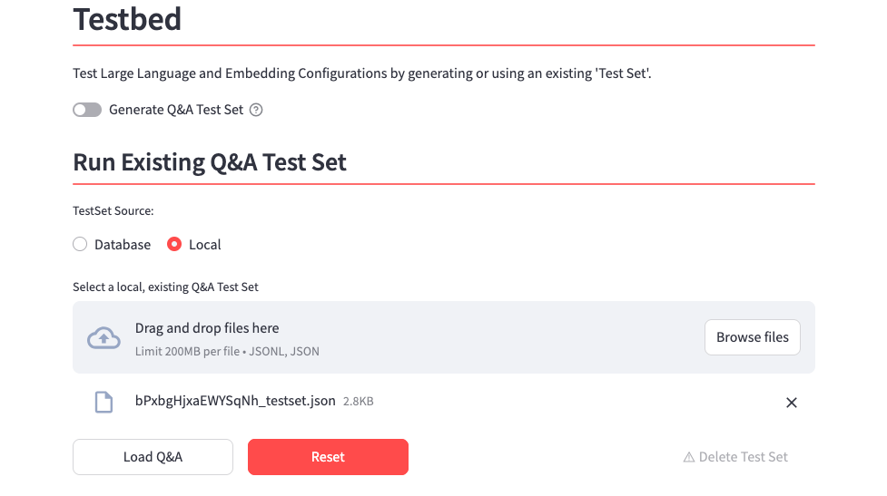

+++
title = '🧪 Testbed'
weight = 30
+++
<!--
Copyright (c) 2023, 2024, Oracle and/or its affiliates.
Licensed under the Universal Permissive License v1.0 as shown at http://oss.oracle.com/licenses/upl.
-->
Generating a Test Dataset of Q&A pairs using an external LLM accelerates testing phase. The  integrates with a framework called [Giskard](https://www.giskard.ai/), designed for this purpose. Giskard analyzes documents to identify high-level topics related to the generated Q&A pairs and includes them in the Test Dataset.  All Test Sets and Evaluations are stored in the database for future evaluations and reviews.



This generation phase is optional but often recommended to reduce the cost of proof-of-concepts, as manually creating test data requires significant human effort.

After generation, the questions are sent to the configured agent. Each answer is collected and compared to the expected answer using an LLM acting as a judge. The judge classifies the responses and provides justifications for each decision, as shown in the following diagram.




## Generation
From the Testbed page, switch to **Generate Q&A Test Set** and upload as many documents you want.  These documents  will be embedded and analyzed by the selected Q&A Language/Embedding Models to generate a defined number of Q&A:



You can choose any of the models available to perform a Q&A generation process.  You maybe interested in using a high profile, expensive model for the crucial dataset generation to evaluate the RAG application, while using a cheaper LLM Model to put into production. 

This phase not only generates the number of Q&A you need, but it will analyze the document provided extracting a set of topics that could help to classify the questions generated and can help to find the area to be improved.

When the generation is over (it could take time):



you can:

* delete a Q&A: clicking **Delete Q&A** you’ll drop the question from the final dataset if you consider it not meaningful;
* modify the text of the **Question** and the **Reference answer**: if you are not agree, you can updated the raw text generated, according the **Reference context** that is it fixed, like the **Metadata**.

Your updates will automatically be stored in the database and you can also download the dataset.

The generation process it’s optional. If you have prepared a JSONL file with your Q&A, according this schema:

```text
[
    {
        "id": <an alphanumeric unique id like ”2f6d5ec5–4111–4ba3–9569–86a7bec8f971">,
        "question":"<Question?>",
        "reference_answer":"<An example of answer considered right>",
        "reference_context":"<A piece of document by which has been extracted the question>",
        "conversation_history":[

        ],
        "metadata":{
            "question_type":"[simple|complex]",
            "seed_document_id":"<numeric>",
            "topic":"<topics>"
        }
    }
]
```

You can upload it:



If you need an example, generate just one Q&A and download it then add to your own Q&As Test Dataset.

## Evaluation
At this point, if you have generated or are using an existing Test Dataset, you can run an evaluation using the configuration parameters in the left hand side.


The top part is related to the LLM are you going to be used for chat generation, and it includes the most relevant hyper-parameters to use in the call. The lower part it’s related to the Vector Store used in which, apart the **Embedding Model**, **Chunk Size**, **Chunk Overlap** and **Distance Strategy**, that are fixed and coming from the **Split/Embed** process you have to perform before, you can modify:

* **Top K**: how many chunks should be included in the prompt’s context from nearer to the question found;
* **Search Type**: that could be Similarity or Maximal Marginal Relevance. The first one is it commonly used, but the second one it’s related to an Oracle DB23ai feature that allows to exclude similar chunks from the top K and give space in the list to different chunks providing more relevant information.

At the end of the evaluation it will be provided an **Overall Correctness Score**, that’s is simply the percentage of correct answers on the total number of questions submitted:


Moreover, a percentage by topics, the list of failures and the full list of Q&As will be evaluated. To each Q&A included into the test dataset, will be added:

* **agent_answer**: the actual answer provided by the RAG app;
* **correctness**: a flag true/false that evaluates if the agent_answer matches the reference_answer;
* **correctness_reason**: the reason why an answer has been evaluated wrong by the judge LLM.

The list of **Failures**, **Correctness by each Q&A**, as well as a **Report**, could be download and stored for future audit activities.

*In this way you can perform several tests using the same curated test dataset, generated or self-made, looking for the best performance RAG configuration*.
