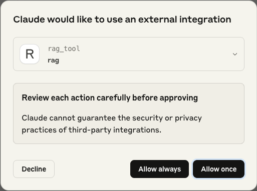

+++
title = 'MCP RAG tool'
weight = 10
+++
## Introduction
This document describe how to re-use the configuration tested in the **AI Optimizer & Toolkit** an expose it as an MCP tool to a local **Claude Desktop**. It will be provided further info to setup as a remote MCP server. This early draft implementation utilizes the `stdio` to interact between the agent dashboard, represented by the **Claude Desktop**, and the tool. 

## Setup
With **[`uv`](https://docs.astral.sh/uv/getting-started/installation/)** installed, run the following commands in your current project directory `<PROJECT_DIR>/src/client/mcp/rag/`:

```bash
uv init --python=3.11 --no-workspace
uv venv --python=3.11
source .venv/bin/activate
uv add mcp langchain-core==0.3.52 oracledb~=3.1 langchain-community==0.3.21 langchain-huggingface==0.1.2 langchain-openai==0.3.13 langchain-ollama==0.3.2
```

## Export config
In the **AI Optimizer & Toolkit** web interface, after tested a configuration, in `Settings/Client Settings`:


* select the checkbox `Include Sensitive Settings` 
* press button `Download Settings` to download configuration in the project directory: `src/client/mcp/rag` as `optimizer_settings.json`.

## Quick test

* Run the inspector:

```bash
npx @modelcontextprotocol/inspector uv run rag_base_optimizer_config_mcp.py
```

* connect to the port `http://localhost:6274/` with your browser
* setup the `Inspector Proxy Address` with `http://127.0.0.1:6277` 
* test the tool developed.


## Claude Desktop setup

* In **Claude Desktop** application, in `Settings/Developer/Edit Config`, get the `claude_desktop_config.json` to add the references to the local MCP server for RAG in the `<PROJECT_DIR>/src/client/mcp/rag/`:
```json
{
 "mcpServers": {
	...
	,
	"rag":{
		"command":"bash",
		"args":[
			"-c",
			"source <PROJECT_DIR>/src/client/mcp/rag/.venv/bin/activate && uv run <PROJECT_DIR>/src/client/mcp/rag/rag_base_optimizer_config_mcp.py"
		]
	}
   }
}
```
* In **Claude Desktop** application, in `Settings/General/Claude Settings/Configure`, under `Profile` tab, update fields like:
- `Full Name`
- `What should we call you`
	
	and so on, putting in `What personal preferences should Claude consider in responses?`
	the following text:

```
#INSTRUCTION:
Always call the rag_tool tool when the user asks a factual or information-seeking question, even if you think you know the answer.
Show the rag_tool message as-is, without modification.
```
This will impose the usage of `rag_tool` in any case. 

**NOTICE**: If you prefer, in this agent dashboard or any other, you could setup a message in the conversation with the same content of `Instruction` to enforce the LLM to use the rag tool as well.

* Restart **Claude Desktop**.

* You will see two warnings on rag_tool configuration: they will disappear and will not cause any issue in activating the tool.

* Start a conversation. You should see a pop up that ask to allow the `rag` tool usage to answer the questions:



 If the question is related to the knowledge base content stored in the vector store, you will have an answer based on that information. Otherwise, it will try to answer considering information on which has been trained the LLM o other tools configured in the same Claude Desktop.


## Make a remote MCP server the RAG Tool

In `rag_base_optimizer_config_mcp.py`:

* Substitute `Local` with `Remote client` line:

```python
#mcp = FastMCP("research", port=8001) #Remote client
mcp = FastMCP("rag") #Local
```

* Substitute `stdio` with `sse` line of code:
```python
  mcp.run(transport='stdio')
  #mcp.run(transport='sse')
```

* Start MCP server with:
```bash
uv run rag_base_optimizer_config_mcp.py
```


## Quick test

* Run the inspector:

```bash
npx @modelcontextprotocol/inspector 
```

* connect the browser to `http://127.0.0.1:6274` 

* set the Transport Type to `SSE`

* set the `URL` to `http://localhost:8001/sse`

* test the tool developed.


## Claude Desktop setup for remote/local server
Claude Desktop, in free version, not allows to connect remote server. You can overcome, for testing purpose only, with a proxy library called `mcp-remote`. These are the options.

### Option 1:
If you have already installed Node.js v18+, it should work:

* replace `rag` mcpServer, setting in `claude_desktop_config.json`:
```json
{
  "mcpServers": {
    "remote": {
      "command": "npx",
      "args": ["mcp-remote", "http://localhost:8001/sse"]
    }
  }
}
```
* restart Claude Desktop. 


### Option 2:
If for any reason Claude desktop has issue in starting this connection, even recent Node has been installed:

* find the absolute position:
```bash
which node
```

* create a file in `<PROJECT_DIR>/src/client/mcp/rag/` named `claude-remote-wrapper.sh`, with the absolute path to Node. For example, if you have `Node v20.17.0`:

```bash
#!/bin/bash
export PATH="$HOME/.nvm/versions/node/v20.17.0/bin:$PATH"
export NODE_VERSION=20.17.0
exec npx mcp-remote "$@"
```

* change the permission:

```bash
chmod +x claude-remote-wrapper.sh
```

* change the `claude_desktop_config.json`:

```json
"remote": {
  "command": "<PROJECT_DIR>/src/client/mcp/rag/claude-remote-wrapper.sh",
  "args": ["http://localhost:8001/sse"]
}
```

* restart and test as remote server

{}
